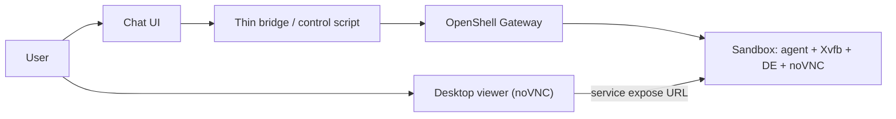

# OpenShell Agent Platform — Architecture Design

**Status:** Draft — MVP scope locked to chat + desktop  
**Author:** Lead Engineer  
**Date:** 2026-10-06 (revised)  
**Audience:** Troy Gilman  

Adapted into this repo as the MVP design. Sections 1–8 are the build target. Appendix A is deferred and is not required to start. The scaffold that matches this doc is listed in [section 9](#9-repository-scaffold).

CLI notes in the scripts were checked against the NVIDIA docs linked in [Appendix B](#appendix-b--references) on 2026-10-06. Where a flag was not on those pages, the repo leaves a TODO instead of inventing one.

## 1. Purpose

Build a minimal agent environment on NVIDIA OpenShell where:

1. The user can **talk to the agent** (chat in / chat out).
2. The user can **see the agent’s desktop** while it works.

Everything else (multi-tenant gateways, connectors, routines, hibernation policy, billing, policy advisor, multi-bot catalog) is explicitly deferred.

OpenShell provides the sandbox, policy fence, and service exposure. We provide a thin control plane and a desktop-capable sandbox image.

## 2. MVP goals and non-goals

### Goals (this MVP only)

- One OpenShell sandbox running a desktop stack (virtual display + VNC/noVNC) and an agent process.
- A simple chat UI (or CLI-backed chat loop) that sends user messages to the agent and streams replies.
- A browser-viewable desktop (noVNC or equivalent) so the user can watch the sandbox screen.
- Deny-by-default network policy with allowlists only for: model/inference API, whatever the chat bridge needs, and local desktop services as required.

### Non-goals (defer)

- Multi-user / multi-org tenancy and per-org gateways
- Bot catalog, templates marketplace, routines, teammates
- OAuth connectors (Gmail, Slack, etc.)
- Watch+control input modes, WebRTC streaming, GPU classes
- Hibernation, warm pools, production quotas/billing
- Hardening for hostile multi-tenant agents
- Abstract `SandboxProvider` swap-out (fine to call OpenShell directly)

## 3. MVP architecture



**Three moving parts:**

| Piece | What it is for MVP |
| --- | --- |
| OpenShell | Local gateway + one sandbox (Docker driver is fine) |
| Sandbox image | Agent CLI/daemon + Xvfb + lightweight DE or browser + noVNC on loopback |
| Thin bridge | Glue that creates the sandbox, forwards chat to the agent, exposes the desktop URL to the user |

No product database, no multi-bot manager, no auth system required for a single-operator MVP—unless we want a password on the noVNC session.

The current scaffold has the image, a deny-by-default policy, and `up`/`down` scripts. The agent process and the chat bridge are the next spike, not this change.

## 4. MVP happy path

1. Install OpenShell; start local gateway (`openshell status` healthy).
2. Build/pull a desktop-capable sandbox image.
3. Create sandbox with a minimal policy (model API + platform/bridge allowlist; desktop ports stay on loopback and are reached via OpenShell service expose).
4. Start agent inside the sandbox (or as the sandbox main process).
5. Expose noVNC via OpenShell service URL; open it in the browser → **see desktop**.
6. Send a chat message through the bridge → agent replies → **talk to agent**.
7. Optionally ask the agent to open a browser or terminal on the desktop so the viewer shows real activity.

**Spike success criteria (same as MVP done):**

1. User message in → agent reply out.
2. Browser shows the sandbox desktop updating while the agent works.
3. Network deny-by-default still blocks an obvious disallowed egress (quick policy sanity check).

Step 6 is not implemented. `scripts/up.sh` prints that there is no chat URL and points at `openshell sandbox connect` until the bridge exists. The policy file keeps the model and bridge allowlists commented out so step 3 cannot accidentally open the network before those hosts are real.

## 5. What we freeze for MVP vs what we leave open

### Frozen for MVP (so we can build)

| Choice | MVP pick | Why |
| --- | --- | --- |
| Compute | Docker on one machine | Fastest path to a working sandbox |
| Desktop transport | noVNC via service expose | Browser-native; matches OpenShell service URLs |
| Desktop input | Watch-only | Chat is the control channel; avoid shared-input complexity |
| Tenancy | Single operator / single gateway | No product auth yet |
| Lifetime | Always-on while demoing | No hibernate logic |
| Credentials | Env/provider for model API only | One integration |
| Policy | One hand-written YAML template | No policy product surface |

The image follows the watch-only pick: `x11vnc -viewonly`, loopback bind, no password stored in git. A runtime VNC password is optional later.

### Explicitly unsolved (documented earlier; not blocking MVP)

These remain open for a later revision of this doc. Do **not** block the spike on them:

- D1 Tenancy model (shared vs per-org gateway)
- D2 MicroVM / Kubernetes for production isolation
- D3 Hibernate / warm pool
- D4 Full DE vs browser-only long term (MVP may use either as long as something is visible)
- D5 WebRTC later
- D6 Shared/exclusive user desktop control
- D7 Production agent↔platform channel design
- D8 Full connector/credential model
- D9 User-editable policies / policy advisor
- D10 Snapshot persistence
- D11 GPU resource classes
- D12 SandboxProvider abstraction

*(Full pros/cons tables for D1–D12 are in Appendix A.)*

D4 is settled only for the scaffold: Openbox plus Falkon, because Ubuntu 24.04's Chromium and Firefox apt packages are snap stubs and do not belong in this image. A Chromium kiosk can replace Falkon later without changing the OpenShell shape.

## 6. Suggested implementation order

1. **OpenShell up** — install, gateway, empty sandbox connect works.
2. **Desktop image** — Xvfb + (XFCE or Chromium kiosk) + x11vnc + noVNC; prove service expose shows pixels.
3. **Agent in sandbox** — run a coding/agent CLI already supported by OpenShell (e.g. Claude Code / Codex / OpenCode) *or* a tiny custom loop; prove chat.
4. **Glue** — one script or small service: `up` (sandbox + expose desktop + print chat entrypoint), `down`.
5. **Policy pass** — lock egress to model + bridge only; confirm blocked curl to a random host.
6. **Stop** — do not build catalog, auth, or multi-bot until this loop feels good.

This repo lands a first cut of steps 2, 4, and the deny-default half of step 5. Steps 1 and 3 still need a machine with OpenShell.

## 7. Risks specific to this thin MVP

| Risk | Mitigation |
| --- | --- |
| OpenShell has no first-party desktop | BYO image; treat desktop as our problem |
| Chat and desktop feel disconnected | Same sandbox for both; agent actions should be visible on screen when possible |
| noVNC auth weak on localhost demo | VNC password + bind via gateway URL only; do not publish raw port |
| Agent needs display env | Set `DISPLAY=:0` (or chosen display) in agent process env |
| Scope creep back into “platform” | Refuse new features until spike criteria pass |

`DISPLAY=:0` is set in the image and the entrypoint. noVNC and x11vnc bind `127.0.0.1` only. The password half of the auth mitigation is still a TODO: nothing in the repo is a VNC secret.

## 8. Next step

The narrowed MVP is the spike in section 4, not more architecture writing.

Immediate work on a single machine:

1. Install OpenShell and confirm `openshell status`. Done on 0.1.2; notes in [spike-notes.md](spike-notes.md).
2. `docker build -t atom-desktop:latest sandbox`, then `./scripts/up.sh`, and open the printed desktop URL. Done for the Docker driver.
3. Put one agent in that sandbox and add the chat glue. Only then fill in the model-API and bridge comments in `policy/mvp-deny-default.yaml`. Blocked until a model provider is attached.

## 9. Repository scaffold

| Piece | File | Notes |
| --- | --- | --- |
| Desktop image | [sandbox/Dockerfile](../sandbox/Dockerfile), [sandbox/entrypoint.sh](../sandbox/entrypoint.sh) | Xvfb + Openbox + xterm + Falkon + x11vnc + websockify. Ports 5900 and 6080 on loopback. User `agent` uid 1500. |
| Policy stub | [policy/mvp-deny-default.yaml](../policy/mvp-deny-default.yaml) | `version: 1`, default filesystem paths, no `network_policies`. Placeholders are comments. |
| Up / down | [scripts/up.sh](../scripts/up.sh), [scripts/down.sh](../scripts/down.sh) | Documented `sandbox create`, `service expose`, `sandbox delete`. Exit if the CLI or gateway is missing. |

OpenShell create shape used by `up.sh` (see the script header for the doc URLs):

```sh
openshell sandbox create \
  --name atom-mvp \
  --from atom-desktop:latest \
  --policy policy/mvp-deny-default.yaml \
  --detach \
  -- /usr/local/bin/atom-desktop-entrypoint

openshell service expose atom-mvp 6080 desktop
```

The trailing command is required. Manage Sandboxes says that command is the canonical main process, and that omitting it starts a login shell. This scaffold does not assume the image `ENTRYPOINT` runs on its own.

`--from` takes an image reference the gateway can already see. It does not build `sandbox/Dockerfile`.

---

## Appendix A — Deferred decisions (pros/cons)

Kept for later product design. Not required to start the MVP.

### D1 — Tenancy: shared gateway vs gateway per user/org

| Option | Pros | Cons |
| --- | --- | --- |
| A. One shared gateway | Lower ops cost | Blast radius; early multi-tenant roughness |
| B. Gateway per org | Clear isolation | More gateways to run |
| C. Gateway per user | Max isolation | Poor scale |

### D2 — Compute driver

| Option | Pros | Cons |
| --- | --- | --- |
| A. Docker/Podman | Fast MVP | Shared kernel |
| B. MicroVM | Stronger isolation | Heavier; GPU/desktop harder |
| C. Kubernetes | Scale | NetworkPolicy foot-guns; awkward desktops |

### D3 — Sandbox lifetime

| Option | Pros | Cons |
| --- | --- | --- |
| A. Always-on | Instant; living desktop | Cost |
| B. Cold per run | Cheap | Latency; lost state |
| C. Warm pool + hibernate | Balance | Complexity |

### D4 — Desktop stack richness

| Option | Pros | Cons |
| --- | --- | --- |
| A. Full lightweight DE | General GUI apps | Heavy/flaky |
| B. Browser kiosk only | Smaller; covers web agents | No native apps |
| C. Headless default + opt-in desktop | Cheap default | Two modes to maintain |

### D5 — Viewer transport

| Option | Pros | Cons |
| --- | --- | --- |
| A. noVNC + service expose | Quick; in-browser | Quality/latency limits |
| B. Native VNC | Better performance | Bad web fit |
| C. Custom WebRTC | Best UX | Large build |

### D6 — User input on desktop

| Option | Pros | Cons |
| --- | --- | --- |
| A. Watch-only | Simple; safe | Cannot unstick GUI by clicking |
| B. Shared control | Flexible | Races; audit noise |
| C. Exclusive modes | Clear ownership | Mode UX |

### D7 — Agent ↔ platform channel

| Option | Pros | Cons |
| --- | --- | --- |
| A. Allowlisted HTTPS to our API | Simple | DIY reconnect/auth |
| B. OpenShell SDK channel | Cleaner lifecycle | SDK maturity |
| C. SSH tunnels | Familiar | Bypasses policy model easily |

### D8 — Credentials / connectors

| Option | Pros | Cons |
| --- | --- | --- |
| A. OpenShell providers only | Secrets outside workload | Coverage gaps |
| B. Platform vault → env inject | Full UX control | Easier to leak into agent |
| C. Hybrid | Best long-term | Two systems |

### D9 — Policy authorship

| Option | Pros | Cons |
| --- | --- | --- |
| A. Fixed templates | Safe; reviewable | Inflexible |
| B. User-edited YAML | Powerful | Foot-guns |
| C. Templates + human-approved proposals | Grows safely | Product complexity |

### D10 — Persistence

| Option | Pros | Cons |
| --- | --- | --- |
| A. Workspace volume | Simple | Rebuild env from image |
| B. Disk snapshots | Fast “whole machine” restore | Storage; GUI consistency |
| C. All state in platform store | Disposable sandboxes | Agents must cooperate |

### D11 — GPU

| Option | Pros | Cons |
| --- | --- | --- |
| A. CPU-only until opt-in | Cheap | Vision/local models limited |
| B. GPU on all desktop bots | Smooth for vision | Expensive |
| C. Separate gpu resource class | Clear packaging | More templates |

### D12 — OpenShell coupling

| Option | Pros | Cons |
| --- | --- | --- |
| A. Hard dependency | Ship faster | API drift risk |
| B. Thin SandboxProvider interface | Swap later | Extra abstraction |
| C. Fork OpenShell | Control | Permanent maintenance |

## Appendix B — References

Checked 2026-10-06. Prefer these stable paths. Older `/dev/` and `/latest/` URLs in the original notes were not all still published.

- [OpenShell overview](https://docs.nvidia.com/openshell/about/overview)
- [Architecture](https://docs.nvidia.com/openshell/about/architecture)
- [Installation](https://docs.nvidia.com/openshell/about/installation)
- [Support matrix](https://docs.nvidia.com/openshell/about/support-matrix)
- [Manage sandboxes](https://docs.nvidia.com/openshell/how-it-works/sandboxes/overview)
- [Manage sandbox policies](https://docs.nvidia.com/openshell/how-it-works/policies/manage-policies)
- [Default policy](https://docs.nvidia.com/openshell/how-it-works/policies/default-policy)
- [Policy schema](https://docs.nvidia.com/openshell/how-it-works/policies/schema)
- [First network policy](https://docs.nvidia.com/openshell/tutorials/first-network-policy)
- [NVIDIA blog — OpenShell 0.1.0](https://developer.nvidia.com/blog/add-runtime-controls-to-ai-agents-with-nvidia-openshell/)
- [GitHub — NVIDIA/OpenShell](https://github.com/NVIDIA/OpenShell)
